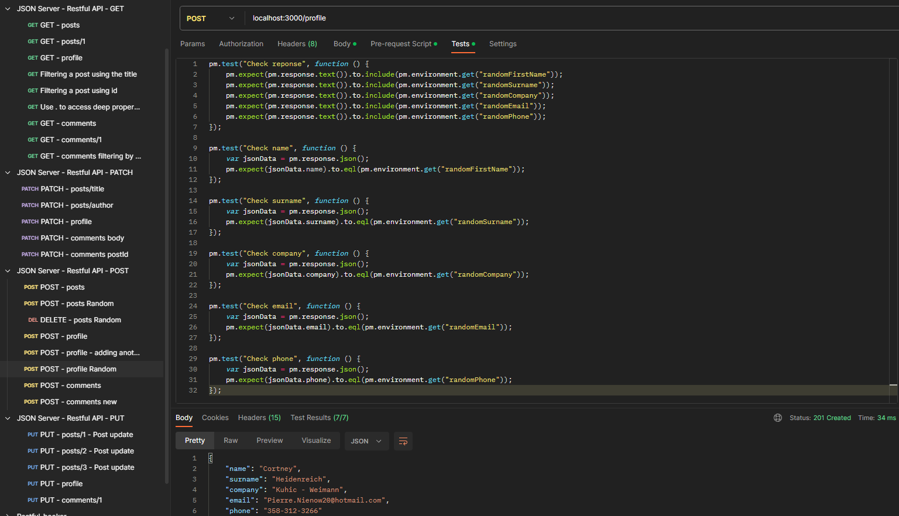

 

# JSON Server - Restful API

- Testing with [JSON Server](https://github.com/typicode/json-server#getting-started) Repository
- Software [Postman](https://www.postman.com)

 

## Start of work:

:small_orange_diamond: Install JSON Server: `npm install -g json-server`  
:small_orange_diamond: Start JSON Servert: `json-server --watch db.json`  
:small_orange_diamond: Local host: ` http://localhost:3000/`

 

## Collections:

 

## HTTP response codes:

| Code      | Description             |
| :-------- | :---------------------- |
| 100 – 199 | Informational responses |
| 200 – 299 | Successful responses    |
| 300 – 399 | Redirection messages    |
| 400 – 499 | Client error responses  |
| 500 – 599 | Server error responses  |

 

### [Information responses:]()

| Code | Description          |
| :--- | :------------------- |
| 100  | Continue             |
| 101  | Switching Protocols  |
| 102  | Processing           |
| 103  | Early Hints          |
| 110  | Connection Timed Out |
| 111  | Connection refused   |

### [Successful responses:]()

| Code | Description                   |
| :--- | :---------------------------- |
| 200  | OK                            |
| 201  | Created                       |
| 202  | Accepted                      |
| 203  | Non-Authoritative Information |
| 204  | No content                    |
| 205  | Reset Content                 |
| 206  | Partial Content               |

### [Redirection messages:]()

| Code | Description        |
| :--- | :----------------- |
| 300  | Multiple Choices   |
| 301  | Moved Permanently  |
| 302  | Found              |
| 303  | See Other          |
| 304  | Not Modified       |
| 305  | Use Proxy          |
| 306  | Switch Proxy       |
| 307  | Temporary Redirect |
| 308  | Permanent Redirect |
| 310  | Too many redirects |

### [Client error responses:]()

| Code | Description                     |
| :--- | :------------------------------ |
| 400  | Bad Request                     |
| 401  | Unauthorized                    |
| 402  | Payment Required                |
| 403  | Forbidden                       |
| 404  | Not Found                       |
| 405  | Method Not Allowed              |
| 406  | Not Acceptable                  |
| 407  | Proxy Authentication Required   |
| 408  | Request Timeout                 |
| 409  | Conflict                        |
| 410  | Gone                            |
| 411  | Length required                 |
| 412  | Precondition Failed             |
| 413  | Request Entity Too Large        |
| 414  | Request-URI Too Long            |
| 415  | Unsupported Media Type          |
| 416  | Requested Range Not Satisfiable |
| 417  | Expectation Failed              |
| 418  | I’m a teapot                    |
| 421  | Misdirected Request             |
| 422  | Unprocessable entity            |
| 423  | Locked (WebDAV)                 |
| 424  | Failed Dependency (WebDAV)      |
| 425  | Too Early                       |
| 426  | Upgrade Required                |
| 428  | Precondition Required           |
| 429  | Too Many Requests               |
| 431  | Request Header Fields Too Large |
| 451  | Unavailable For Legal Reasons   |

### [Server error responses:]()

| Code | Description                     |
| :--- | :------------------------------ |
| 500  | Internal Server Error           |
| 501  | Not Implemented                 |
| 502  | Bad Gateway                     |
| 503  | Service Unavailable             |
| 504  | Gateway Timeout                 |
| 505  | HTTP Version Not Supported      |
| 506  | Variant Also Negotiates         |
| 507  | Insufficient Storage (WebDAV)   |
| 508  | Loop Detected (WebDAV)          |
| 509  | Bandwidth Limit Exceeded        |
| 510  | Not Extended                    |
| 511  | Network Authentication Required |
